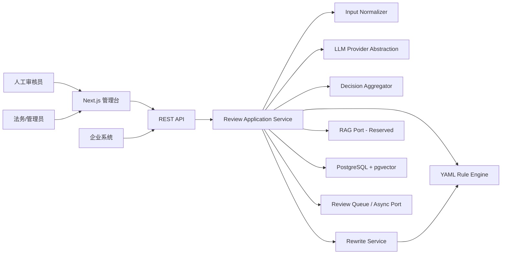

# 系统架构设计

## 1. 架构目标

系统应优先保证审核结果可解释、可复现、可降级和可审计。规则引擎负责明确边界，LLM 负责语义理解与文案生成，人工复核负责不确定和高影响场景。

## 2. 逻辑架构



## 3. 建议代码边界

采用模块化单体作为 MVP 起点，避免过早拆分微服务：

| 模块           | 职责                                      | 禁止承担         |
| -------------- | ----------------------------------------- | ---------------- |
| `api`          | HTTP、鉴权、校验、错误映射                | 审核业务判断     |
| `review`       | 编排审核用例和状态机                      | 供应商 SDK 细节  |
| `rule-engine`  | 加载、校验、执行和解释 YAML 规则          | LLM 调用         |
| `decision`     | 风险聚合、优先级和结论计算                | 文案生成         |
| `rewrite`      | 建议与改写、改写后二次检查                | 修改原始记录     |
| `llm`          | Provider 接口、结构化输出、重试和成本统计 | 业务决策优先级   |
| `rag`          | 检索接口与引用对象                        | MVP 强依赖       |
| `review-queue` | 人工复核状态与操作                        | 自动修改机器结果 |
| `audit`        | 追加式事件、脱敏和查询                    | 可变业务实体存储 |
| `persistence`  | PostgreSQL repository 与事务              | HTTP 语义        |

前后端可采用 monorepo，但共享包仅放稳定契约、类型和通用校验，不共享数据库实体。

## 4. 核心审核管线

1. API 建立 `request_id` 和租户上下文。
2. 保存输入快照，完成字段校验、Unicode/空白标准化和文本分段。
3. 解析适用规则集；无法解析地区时按默认规则集执行并标记复核风险。
4. 规则引擎先执行硬规则和可解释模式规则。
5. 若策略允许且存在语义任务，调用 LLM；响应必须通过 JSON Schema 校验。
6. 决策聚合器合并命中，执行去重、优先级、阈值和冲突处理。
7. 对可修正内容生成建议与改写，并对改写文案再次执行规则检查。
8. 在一个业务事务中保存结果、命中项和状态；外部调用日志独立追加。
9. 对 `REVIEW` 创建人工复核任务。

## 5. 状态模型

审核任务状态：

```text
RECEIVED -> PROCESSING -> COMPLETED
                      -> NEEDS_REVIEW -> COMPLETED
                      -> FAILED
```

- `COMPLETED` 表示机器流程完成，不等于 `PASS`。
- 人工复核中的任务使用 `NEEDS_REVIEW`，人工决定后进入 `COMPLETED`。
- `FAILED` 仅用于无法形成安全结论的系统错误；客户端不得把它视为通过。

## 6. LLM 抽象层

建议接口能力：

- `analyzeJob(input, context, options)`：语义风险识别
- `rewriteJob(input, findings, constraints)`：合规改写
- `healthCheck()`：供应商健康状态
- 能力描述：结构化输出、最大上下文、地区、数据策略

统一返回供应商、模型、请求 ID、token、耗时、重试次数和规范化结果。Provider SDK 异常不得泄漏到领域层。

### 降级策略

- Provider 超时或不可用：保留规则结果；原本需要模型判断的请求返回 `REVIEW`
- Schema 校验失败：有限次数修复/重试，仍失败则 `REVIEW`
- 模型与硬规则冲突：硬规则优先
- 多模型并非 MVP 必需；接口应允许后续路由和回退

## 7. 数据与事务

- PostgreSQL 是业务事实来源；pgvector 与业务库同实例仅为 MVP 简化
- 规则文件存储在版本库，发布后将内容哈希和快照写入数据库
- 原始岗位输入与审核结果不可原地覆盖；新审核产生新记录
- 人工结论作为独立决策记录，`reviews.final_decision` 仅作当前投影
- 审计事件采用追加写；写失败应阻止关键管理操作完成

## 8. API 与异步演进

MVP 支持单条同步创建，内部仍以任务模型实现。后续增加：

- 异步提交和 Webhook
- 批量审核
- 规则发布任务
- Embedding 与知识库索引任务

HTTP 契约详见 `API_SPEC.md`。

## 9. 安全设计

- 所有业务表带 `tenant_id`，Repository 默认强制租户条件
- API 使用短期访问令牌或服务端 API Key；管理操作使用 RBAC
- 外部模型调用前按配置脱敏；禁止发送内部租户标识和无关个人信息
- Secret 只从 Secret Manager/环境注入，不写入 YAML、数据库明文或日志
- 审计日志记录配置变更、规则发布、复核和数据导出
- 对输入长度、请求频率、批量大小和 LLM 成本设置配额

## 10. 可观测性

### 指标

- 请求量、结论分布、风险类别分布
- 审核 P50/P95/P99、规则和模型阶段耗时
- LLM 错误率、Schema 失败率、token 与估算成本
- 人工复核率、推翻率、队列时长
- 按规则 ID 的命中率和误报反馈率

### 日志与追踪

- 统一 `request_id`、`review_id`、`tenant_id` 和 trace ID
- 业务日志默认不记录完整岗位原文和模型密钥
- OpenTelemetry 作为建议标准，具体后端待选

## 11. 部署建议

MVP 组件：

- `web`：Next.js 管理台
- `api`：Node.js + TypeScript 服务
- `worker`：可与 API 同代码库、独立进程部署
- `postgres`：启用 pgvector 扩展

环境至少区分 development、staging、production。规则发布、数据库迁移和模型配置均需环境级审批。

## 12. 架构决策记录候选

- ADR-001：MVP 使用模块化单体
- ADR-002：确定性规则优先于 LLM
- ADR-003：规则文件 Git 管理、数据库保存发布快照
- ADR-004：LLM 失败默认进入人工复核
- ADR-005：原始输入和决策采用不可变历史记录
