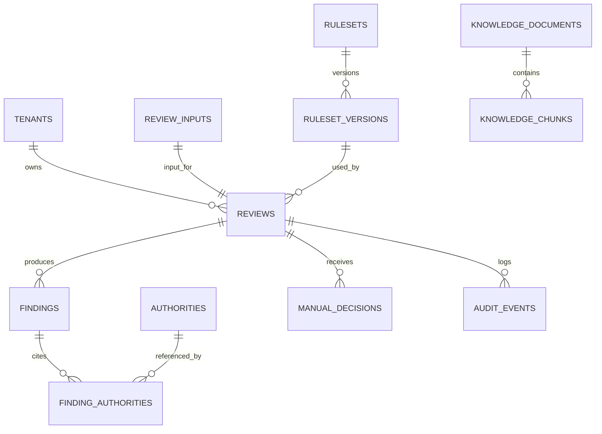

# 数据库设计

## 1. 设计原则

- PostgreSQL 为业务事实来源，启用 `pgvector` 预留知识检索
- 业务数据按租户隔离，所有查询默认带 `tenant_id`
- 审核输入、机器决策、人工决策和审计事件保留历史
- 法规依据与规则版本必须能还原审核发生时的内容
- 大文本、Embedding 和日志设置独立保留策略

## 2. 主要实体关系

## 3. 表定义

### `tenants`

| 字段         | 类型        | 说明                 |
| ------------ | ----------- | -------------------- |
| `id`         | uuid PK     | 租户 ID              |
| `name`       | text        | 租户名称             |
| `status`     | text        | `ACTIVE`/`SUSPENDED` |
| `settings`   | jsonb       | 非敏感租户策略       |
| `created_at` | timestamptz | 创建时间             |

### `review_inputs`

| 字段            | 类型          | 说明           |
| --------------- | ------------- | -------------- |
| `id`            | uuid PK       | 输入快照 ID    |
| `tenant_id`     | uuid FK       | 租户           |
| `external_id`   | text nullable | 客户业务 ID    |
| `jurisdiction`  | text          | 适用地区       |
| `locale`        | text          | 语言地区       |
| `platform`      | text          | 平台标识       |
| `job_payload`   | jsonb         | 规范化岗位结构 |
| `raw_text_hash` | text          | 输入内容哈希   |
| `created_at`    | timestamptz   | 创建时间       |

原始请求如需保留，建议加密存储于独立字段或对象存储，不与可查询日志混用。

### `reviews`

| 字段                 | 类型                 | 说明             |
| -------------------- | -------------------- | ---------------- |
| `id`                 | uuid PK              | 审核 ID          |
| `tenant_id`          | uuid FK              | 租户             |
| `input_id`           | uuid FK unique       | 输入快照         |
| `ruleset_version_id` | uuid FK              | 使用的规则版本   |
| `status`             | text                 | 审核状态         |
| `machine_decision`   | text nullable        | 机器结论         |
| `final_decision`     | text nullable        | 当前最终结论投影 |
| `risk_level`         | text nullable        | 当前风险等级     |
| `risk_score`         | smallint nullable    | 0-100            |
| `summary`            | text nullable        | 结果摘要         |
| `compliant_rewrite`  | text nullable        | 二次校验后的改写 |
| `rewrite_validation` | jsonb nullable       | 改写校验摘要     |
| `model_run_id`       | uuid nullable        | 主要模型执行记录 |
| `version`            | integer              | 乐观锁版本       |
| `started_at`         | timestamptz nullable | 开始时间         |
| `completed_at`       | timestamptz nullable | 完成时间         |
| `created_at`         | timestamptz          | 创建时间         |

约束：风险分为 0-100；完成态必须有机器结论；`PASS` 不得存在有效硬拦截 finding。

### `findings`

| 字段          | 类型                  | 说明                        |
| ------------- | --------------------- | --------------------------- |
| `id`          | uuid PK               | 命中项 ID                   |
| `tenant_id`   | uuid FK               | 租户                        |
| `review_id`   | uuid FK               | 审核                        |
| `rule_id`     | text                  | 稳定规则 ID                 |
| `category`    | text                  | 风险类别                    |
| `severity`    | text                  | 严重度                      |
| `disposition` | text                  | 建议处置                    |
| `source`      | text                  | `RULE`/`LLM`/`RAG`/`MANUAL` |
| `message`     | text                  | 解释                        |
| `evidence`    | jsonb                 | 字段、引文与偏移位置数组    |
| `confidence`  | numeric(5,4) nullable | 规范化置信度                |
| `suggestion`  | jsonb nullable        | 修改建议                    |
| `created_at`  | timestamptz           | 创建时间                    |

索引：`(tenant_id, review_id)`、`(tenant_id, rule_id, created_at)`、类别与严重度的组合索引。

### `authorities`

| 字段             | 类型          | 说明                       |
| ---------------- | ------------- | -------------------------- |
| `id`             | uuid PK       | 依据 ID                    |
| `jurisdiction`   | text          | 适用地区                   |
| `type`           | text          | 法律、行政法规、平台规则等 |
| `code`           | text          | 稳定标识                   |
| `title`          | text          | 标题                       |
| `version`        | text          | 版本                       |
| `effective_from` | date nullable | 生效日期                   |
| `effective_to`   | date nullable | 失效日期                   |
| `source_url`     | text nullable | 官方来源                   |
| `content_hash`   | text          | 内容哈希                   |
| `status`         | text          | 草稿、有效、失效           |

### `finding_authorities`

保存审核时引用快照，避免依据更新后历史结果漂移：

- `finding_id`、`authority_id`
- `article`、`quoted_summary`
- `authority_version`、`content_hash`
- 复合主键 `(finding_id, authority_id, article)`

### `rulesets` 与 `ruleset_versions`

`rulesets` 保存逻辑规则集身份：租户/平台/司法辖区、名称和当前发布版本。

`ruleset_versions` 保存：

- 语义版本 `version`
- 状态 `DRAFT`/`VALIDATED`/`PUBLISHED`/`RETIRED`
- YAML 内容或对象存储地址
- `content_hash`、schema 版本、变更说明
- 校验报告、创建人、审批人、发布时间

同一规则集版本唯一；同一规则集同一时刻只允许一个当前发布版本。

### `model_runs`

| 字段             | 类型           | 说明                         |
| ---------------- | -------------- | ---------------------------- |
| `id`             | uuid PK        | 执行 ID                      |
| `tenant_id`      | uuid FK        | 租户                         |
| `review_id`      | uuid FK        | 审核                         |
| `purpose`        | text           | `ANALYZE`/`REWRITE`/`REPAIR` |
| `provider`       | text           | 提供方                       |
| `model`          | text           | 模型名                       |
| `prompt_version` | text           | 提示词版本                   |
| `input_hash`     | text           | 模型输入哈希                 |
| `output_payload` | jsonb nullable | 脱敏后的结构化输出           |
| `status`         | text           | 成功/失败/超时               |
| `tokens_in/out`  | integer        | token 统计                   |
| `latency_ms`     | integer        | 耗时                         |
| `error_code`     | text nullable  | 规范化错误                   |
| `created_at`     | timestamptz    | 时间                         |

是否保存原始提示词和响应由数据策略决定，默认不长期保存敏感原文。

### `manual_decisions`

- `id`、`tenant_id`、`review_id`
- `reviewer_id`、`decision`、`risk_level`
- `reason_code`、`comment`、`finding_ids` jsonb
- `previous_final_decision`、`created_at`

记录不可更新；修正通过追加新决定实现。

### `audit_events`

- `id` uuid/有序 ID
- `tenant_id`、`review_id` nullable
- `event_type`、`actor_type`、`actor_id`
- `request_id`、`trace_id`
- `payload` jsonb（脱敏）
- `created_at`

对审计表限制 UPDATE/DELETE 权限，可按月分区并转存归档。

### RAG 预留表

`knowledge_documents`：来源、标题、司法辖区、版本、生效日期、哈希、状态、元数据。

`knowledge_chunks`：文档 ID、段落路径、正文、token 数、`embedding vector(n)`、embedding 模型、元数据。

向量维度 `n` 必须由选定 embedding 模型后通过迁移固定，不在初始迁移中猜定。

## 4. 幂等与唯一性

- 建议新增 `idempotency_keys(tenant_id, key, request_hash, review_id, expires_at)`
- `(tenant_id, external_id)` 不应默认唯一，允许同一岗位多次审核
- 规则 ID 在一个规则集版本内唯一，并保持跨版本语义稳定

## 5. 数据保留与删除

需在上线前确定：

- 岗位输入和结果在线保留期
- 模型运行明细保留期
- 审计日志法定/合同保留期
- 租户删除时的软删除、延迟硬删除和法律保留流程
- 评测样本的去标识化与单独授权

## 6. 迁移顺序建议

1. 扩展、租户与身份基础表
2. 规则集与依据表
3. 审核输入、审核、命中和模型执行表
4. 人工决策、审计和幂等表
5. RAG 文档与向量表（后续阶段）
