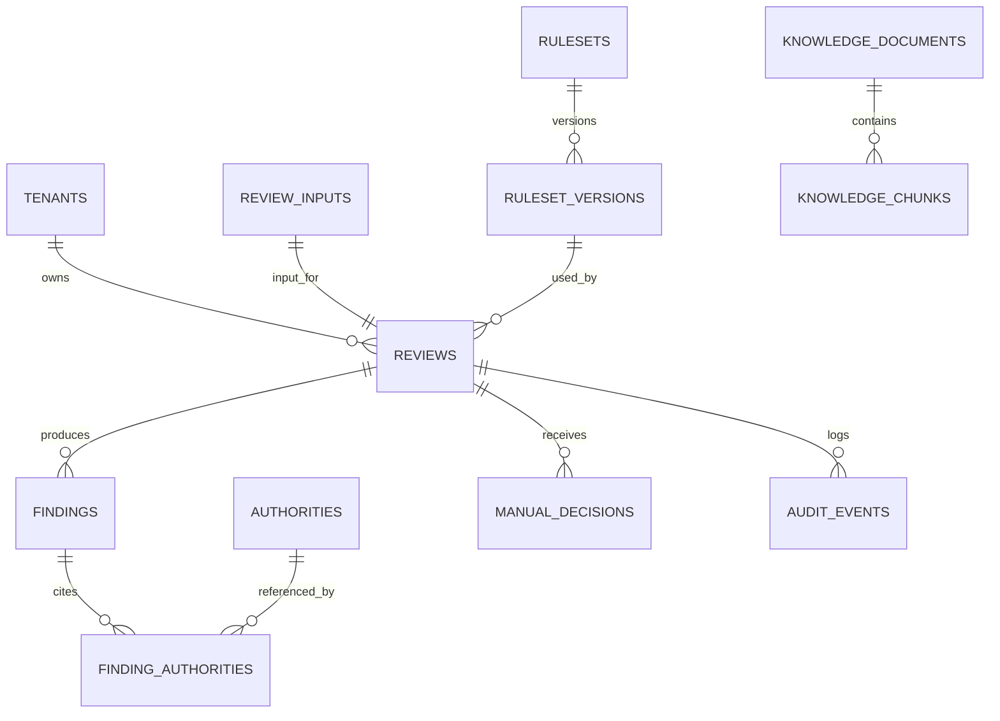

# 数据库设计

## 1. 设计原则

- PostgreSQL 为业务事实来源，启用 `pgvector` 预留知识检索
- 业务数据按租户隔离，所有查询默认带 `tenant_id`
- 审核输入、机器决策、人工决策和审计事件保留历史
- 法规依据与规则版本必须能还原审核发生时的内容
- 大文本、Embedding 和日志设置独立保留策略

## 2. 主要实体关系

## 3. 表定义

### `tenants`

| 字段         | 类型        | 说明                 |
| ------------ | ----------- | -------------------- |
| `id`         | uuid PK     | 租户 ID              |
| `name`       | text        | 租户名称             |
| `status`     | text        | `ACTIVE`/`SUSPENDED` |
| `settings`   | jsonb       | 非敏感租户策略       |
| `created_at` | timestamptz | 创建时间             |

### `review_inputs`

| 字段            | 类型          | 说明           |
| --------------- | ------------- | -------------- |
| `id`            | uuid PK       | 输入快照 ID    |
| `tenant_id`     | uuid FK       | 租户           |
| `external_id`   | text nullable | 客户业务 ID    |
| `jurisdiction`  | text          | 适用地区       |
| `locale`        | text          | 语言地区       |
| `platform`      | text          | 平台标识       |
| `job_payload`   | jsonb         | 规范化岗位结构 |
| `raw_text_hash` | text          | 输入内容哈希   |
| `created_at`    | timestamptz   | 创建时间       |

原始请求如需保留，建议加密存储于独立字段或对象存储，不与可查询日志混用。

### `reviews`

| 字段                 | 类型                 | 说明             |
| -------------------- | -------------------- | ---------------- |
| `id`                 | uuid PK              | 审核 ID          |
| `tenant_id`          | uuid FK              | 租户             |
| `input_id`           | uuid FK unique       | 输入快照         |
| `ruleset_version_id` | uuid FK              | 使用的规则版本   |
| `status`             | text                 | 审核状态         |
| `machine_decision`   | text nullable        | 机器结论         |
| `final_decision`     | text nullable        | 当前最终结论投影 |
| `risk_level`         | text nullable        | 当前风险等级     |
| `risk_score`         | smallint nullable    | 0-100            |
| `summary`            | text nullable        | 结果摘要         |
| `compliant_rewrite`  | text nullable        | 二次校验后的改写 |
| `rewrite_validation` | jsonb nullable       | 改写校验摘要     |
| `model_run_id`       | uuid nullable        | 主要模型执行记录 |
| `version`            | integer              | 乐观锁版本       |
| `started_at`         | timestamptz nullable | 开始时间         |
| `completed_at`       | timestamptz nullable | 完成时间         |
| `created_at`         | timestamptz          | 创建时间         |

约束：风险分为 0-100；完成态必须有机器结论；`PASS` 不得存在有效硬拦截 finding。

### `findings`

| 字段          | 类型                  | 说明                        |
| ------------- | --------------------- | --------------------------- |
| `id`          | uuid PK               | 命中项 ID                   |
| `tenant_id`   | uuid FK               | 租户                        |
| `review_id`   | uuid FK               | 审核                        |
| `rule_id`     | text                  | 稳定规则 ID                 |
| `category`    | text                  | 风险类别                    |
| `severity`    | text                  | 严重度                      |
| `disposition` | text                  | 建议处置                    |
| `source`      | text                  | `RULE`/`LLM`/`RAG`/`MANUAL` |
| `message`     | text                  | 解释                        |
| `evidence`    | jsonb                 | 字段、引文与偏移位置数组    |
| `confidence`  | numeric(5,4) nullable | 规范化置信度                |
| `suggestion`  | jsonb nullable        | 修改建议                    |
| `created_at`  | timestamptz           | 创建时间                    |

索引：`(tenant_id, review_id)`、`(tenant_id, rule_id, created_at)`、类别与严重度的组合索引。

### `authorities`

| 字段             | 类型          | 说明                       |
| ---------------- | ------------- | -------------------------- |
| `id`             | uuid PK       | 依据 ID                    |
| `jurisdiction`   | text          | 适用地区                   |
| `type`           | text          | 法律、行政法规、平台规则等 |
| `code`           | text          | 稳定标识                   |
| `title`          | text          | 标题                       |
| `version`        | text          | 版本                       |
| `effective_from` | date nullable | 生效日期                   |
| `effective_to`   | date nullable | 失效日期                   |
| `source_url`     | text nullable | 官方来源                   |
| `content_hash`   | text          | 内容哈希                   |
| `status`         | text          | 草稿、有效、失效           |

### `finding_authorities`

保存审核时引用快照，避免依据更新后历史结果漂移：

- `finding_id`、`authority_id`
- `article`、`quoted_summary`
- `authority_version`、`content_hash`
- 复合主键 `(finding_id, authority_id, article)`

### `rulesets` 与 `ruleset_versions`

`rulesets` 保存逻辑规则集身份：租户/平台/司法辖区、名称和当前发布版本。

`ruleset_versions` 保存：

- 语义版本 `version`
- 状态 `DRAFT`/`VALIDATED`/`PUBLISHED`/`RETIRED`
- YAML 内容或对象存储地址
- `content_hash`、schema 版本、变更说明
- 校验报告、创建人、审批人、发布时间

同一规则集版本唯一；同一规则集同一时刻只允许一个当前发布版本。

MVP 规则运营实现补充以下表：

`rule_sets` 保存规则集运营投影：

- `id`
- `name`
- `jurisdiction`
- `status`
- `current_version`
- `description`
- `payload`
- `created_at`
- `updated_at`

`compliance_rules` 保留已发布或草稿规则快照，新增运营字段：

- `rule_set_id`
- `status`

`rule_publish_records` 保存发布与回滚记录：

- `id`
- `rule_set_id`
- `rule_version`
- `previous_version`
- `action`
- `actor_id`
- `eval_passed`
- `force_published`
- `rule_count`
- `payload`
- `created_at`

### `model_runs`

| 字段             | 类型           | 说明                         |
| ---------------- | -------------- | ---------------------------- |
| `id`             | uuid PK        | 执行 ID                      |
| `tenant_id`      | uuid FK        | 租户                         |
| `review_id`      | uuid FK        | 审核                         |
| `purpose`        | text           | `ANALYZE`/`REWRITE`/`REPAIR` |
| `provider`       | text           | 提供方                       |
| `model`          | text           | 模型名                       |
| `prompt_version` | text           | 提示词版本                   |
| `input_hash`     | text           | 模型输入哈希                 |
| `output_payload` | jsonb nullable | 脱敏后的结构化输出           |
| `status`         | text           | 成功/失败/超时               |
| `tokens_in/out`  | integer        | token 统计                   |
| `latency_ms`     | integer        | 耗时                         |
| `error_code`     | text nullable  | 规范化错误                   |
| `created_at`     | timestamptz    | 时间                         |

是否保存原始提示词和响应由数据策略决定，默认不长期保存敏感原文。

### `manual_decisions`

- `id`、`tenant_id`、`review_id`
- `reviewer_id`、`decision`、`risk_level`
- `reason_code`、`comment`、`finding_ids` jsonb
- `previous_final_decision`、`created_at`

记录不可更新；修正通过追加新决定实现。

### Human Review 闭环表

MVP 当前实现增加以下实体，用于让人工复核反哺评估集和规则改进。

`review_tickets` 保存需要人工复核的任务投影：

- `id`
- `audit_run_id`
- `tenant_id`
- `status`
- `agent_decision`
- `risk_level`
- `suggested_action`
- `summary_redacted`
- `payload`
- `created_at`
- `updated_at`

`human_review_feedback` 保存人工反馈，新增字段包括：

- `review_ticket_id`
- `agent_decision`
- `final_decision`
- `feedback_type`
- `comment_redacted`
- `payload`

`rule_improvement_suggestions` 保存由复核反馈生成的规则改进建议：

- `id`
- `review_ticket_id`
- `audit_run_id`
- `tenant_id`
- `feedback_type`
- `category`
- `rule_id`
- `title`
- `description_redacted`
- `status`
- `created_by`
- `resolved_by`
- `resolution_comment_redacted`
- `payload`
- `created_at`
- `updated_at`
- `resolved_at`

### `audit_events`

- `id` uuid/有序 ID
- `tenant_id`、`review_id` nullable
- `event_type`、`actor_type`、`actor_id`
- `request_id`、`trace_id`
- `payload` jsonb（脱敏）
- `created_at`

对审计表限制 UPDATE/DELETE 权限，可按月分区并转存归档。

### RAG 预留表

`knowledge_documents`：来源、标题、司法辖区、版本、生效日期、哈希、状态、元数据。

`knowledge_chunks`：文档 ID、段落路径、正文、token 数、`embedding vector(n)`、embedding 模型、元数据。

向量维度 `n` 必须由选定 embedding 模型后通过迁移固定，不在初始迁移中猜定。

### Eval 评测表

`eval_datasets` 保存评测集身份：

- `id`
- `name`
- `version`
- `description`
- `created_at`

`eval_cases` 保存评测样本：

- `id`
- `dataset_id`
- `source`
- `title`
- `description`
- `expected_decision`
- `expected_categories`
- `expected_severity`
- `human_reason`
- `metadata`
- `created_at`

`eval_runs` 保存一次评测运行摘要：

- `id`
- `dataset_id`
- `rule_version`
- `law_kb_version`
- `model_version`
- `total_cases`
- `passed_cases`
- `failed_cases`
- `decision_accuracy`
- `category_recall`
- `category_precision`
- `high_risk_recall`
- `critical_recall`
- `false_positive_rate`
- `false_negative_rate`
- `manual_review_rate`
- `evidence_accuracy`
- `rewrite_safety_rate`
- `created_at`

`eval_failures` 保存失败样本明细：

- `id`
- `eval_run_id`
- `case_id`
- `expected`
- `actual`
- `failure_type`
- `reason`
- `created_at`

### Runtime / Rollout / Metrics 表

`audit_runs` 增加：

- `model_version`：审核时使用的模型配置版本；MVP 默认为 `mock-none`

`runtime_configs` 保存当前稳定运行时版本：

- `key`：`ruleVersion`、`lawKbVersion` 或 `modelVersion`
- `stable_version`
- `candidate_version`
- `description`
- `updated_by`
- `payload`
- `updated_at`

`rollout_plans` 保存灰度计划：

- `id`
- `target`：灰度目标，允许 `ruleVersion`、`lawKbVersion`、`modelVersion`
- `stable_version`
- `candidate_version`
- `tenant_allow_list`
- `rollout_percent`
- `status`：`active`、`paused`、`completed`、`rolled_back`
- `created_by`
- `description`
- `payload`
- `created_at`
- `updated_at`

`audit_metrics_daily` 保存可聚合审核指标：

- `id`
- `metric_date`
- `tenant_id`
- `rule_version`
- `law_kb_version`
- `model_version`
- `audit_total`
- `reject_total`
- `manual_review_total`
- `critical_finding_total`
- `rule_hit_by_rule_id`
- `llm_error_total`
- `rag_no_result_total`
- `api_error_total`
- `p95_latency`
- `payload`
- `created_at`
- `updated_at`

`alert_events` 保存指标阈值告警：

- `id`
- `type`
- `severity`
- `status`
- `metric_key`
- `metric_value`
- `threshold`
- `message`
- `payload`
- `created_at`
- `resolved_at`

### Beta Trial 试运行表

`tenant_level_modes` 保存租户级试运行模式：

- `tenant_id`
- `mode`：`shadow_mode`、`assist_mode`、`enforce_mode`
- `enabled`
- `updated_by`
- `payload`
- `updated_at`

`beta_trial_runs` 保存每次 Agent 试运行及人工对比结果：

- `id`
- `tenant_id`
- `audit_run_id`
- `mode`
- `agent_decision`
- `agent_risk_level`
- `human_decision`
- `feedback_type`
- `comparison_result`
- `false_positive`
- `false_negative`
- `business_impact_applied`
- `agent_rule_ids`
- `agent_evidence_ids`
- `payload`
- `created_at`
- `updated_at`

### 审核 SOP 与标注体系表

`reviewer_decisions` 保存审核员对同一复核样本的独立标注：

- `id`
- `review_ticket_id`
- `audit_run_id`
- `tenant_id`
- `reviewer_id`
- `final_decision`
- `normalized_decision`
- `categories`
- `severity`
- `feedback_type`
- `comment_redacted`
- `confidence`
- `payload`
- `created_at`

同一 `review_ticket_id + reviewer_id` 唯一，允许不同审核员对同一条样本标注。

`reviewer_agreement_stats` 保存审核员一致性统计投影：

- `reviewer_id`
- `total_labeled`
- `agreement_count`
- `disagreement_count`
- `agreement_rate`
- `payload`
- `updated_at`

`disputed_cases` 保存多人标注不一致样本：

- `id`
- `review_ticket_id`
- `audit_run_id`
- `tenant_id`
- `status`
- `reason`
- `reviewer_decision_ids`
- `final_decision`
- `final_categories`
- `final_severity`
- `resolved_by`
- `resolution_comment_redacted`
- `payload`
- `created_at`
- `updated_at`
- `resolved_at`

争议样本进入 eval 前必须先由高级审核员裁决。

### 权限、租户成员与审计表

`users` 保存系统用户：

- `id`
- `display_name`
- `email`
- `status`
- `payload`
- `created_at`
- `updated_at`

`roles` 保存角色定义：

- `id`
- `name`
- `description`
- `payload`
- `created_at`

`permissions` 保存权限定义：

- `id`
- `name`
- `description`
- `payload`
- `created_at`

`tenant_members` 保存用户与租户关系：

- `id`
- `tenant_id`
- `user_id`
- `role`
- `payload`
- `created_at`

`audit_operation_logs` 保存敏感操作审计日志：

- `id`
- `actor_user_id`
- `actor_role`
- `tenant_id`
- `operation`
- `resource_type`
- `resource_id`
- `before_payload`
- `after_payload`
- `request_id`
- `payload`
- `created_at`

`rule_publish_approvals` 保存规则发布和回滚审批记录：

- `id`
- `rule_set_id`
- `rule_version`
- `action`
- `status`
- `requested_by`
- `approved_by`
- `comment_redacted`
- `payload`
- `created_at`
- `approved_at`

`data_retention_jobs` 保存数据保留期限配置：

- `id`
- `tenant_id`
- `resource_type`
- `retention_days`
- `enabled`
- `last_run_at`
- `payload`
- `created_at`
- `updated_at`

`data_deletion_requests` 保存可审计的数据删除请求：

- `id`
- `tenant_id`
- `requester_id`
- `target_type`
- `target_id`
- `status`
- `deleted_records`
- `reason_redacted`
- `payload`
- `created_at`
- `completed_at`

`privacy_export_requests` 保存脱敏审计导出请求：

- `id`
- `tenant_id`
- `requester_id`
- `status`
- `export_payload`
- `payload`
- `created_at`
- `completed_at`

`security_check_results` 保存上线前安全与合规检查结果：

- `id`
- `status`
- `summary`
- `checks`
- `payload`
- `created_at`

`appeal_cases` 保存企业申诉主记录：

- `id`
- `tenant_id`
- `audit_run_id`
- `status`
- `reason_type`
- `reason_text_redacted`
- `supplemental_text_redacted`
- `submitter_id`
- `original_decision`
- `original_risk_level`
- `original_findings`
- `original_evidence`
- `payload`
- `created_at`
- `updated_at`

`appeal_messages` 保存申诉补充说明和沟通记录：

- `id`
- `appeal_case_id`
- `tenant_id`
- `sender_type`
- `sender_id`
- `message_redacted`
- `attachments`
- `payload`
- `created_at`

`appeal_agent_reports` 保存 Appeal Agent 复审建议：

- `id`
- `appeal_case_id`
- `tenant_id`
- `maintain_reasons`
- `overturn_reasons`
- `evidence_summary`
- `similar_cases`
- `recommendation`
- `confidence`
- `payload`
- `created_at`

`appeal_review_results` 保存人工复审最终决定：

- `id`
- `appeal_case_id`
- `tenant_id`
- `reviewer_id`
- `final_decision`
- `comment_redacted`
- `payload`
- `created_at`

`api_keys` 保存 API Key 元数据和哈希：

- `id`
- `tenant_id`
- `name`
- `key_hash`
- `key_prefix`
- `status`
- `payload`
- `created_at`
- `last_used_at`
- `revoked_at`

`usage_records` 保存 API 调用用量：

- `id`
- `tenant_id`
- `api_key_id`
- `resource_type`
- `quantity`
- `period`
- `metadata`
- `payload`
- `created_at`

`subscription_plans` 保存套餐定义：

- `id`
- `name`
- `monthly_quota`
- `features`
- `price_label`
- `status`
- `payload`
- `created_at`
- `updated_at`

`tenant_billing_profiles` 保存租户套餐、额度和品牌配置：

- `tenant_id`
- `tenant_name`
- `plan_id`
- `monthly_quota`
- `used_quota`
- `period`
- `brand_config`
- `status`
- `payload`
- `created_at`
- `updated_at`

`webhooks` 保存租户回调配置：

- `id`
- `tenant_id`
- `url`
- `events`
- `secret_hash`
- `status`
- `payload`
- `created_at`
- `updated_at`
- `last_delivery_at`

`batch_audit_jobs` 保存批量审核任务：

- `id`
- `tenant_id`
- `status`
- `total_count`
- `completed_count`
- `failed_count`
- `result_ids`
- `errors`
- `payload`
- `created_at`
- `updated_at`

### 性能、成本与异步队列表

`async_jobs` 保存通用异步任务投影：

- `id`
- `type`
- `tenant_id`
- `status`
- `batch_id`
- `batch_item_id`
- `audit_run_id`
- `error_redacted`
- `payload`
- `created_at`
- `updated_at`
- `started_at`
- `completed_at`

`batch_audit_items` 保存批量审核中的单条任务：

- `id`
- `batch_id`
- `tenant_id`
- `job_posting_id`
- `status`
- `audit_run_id`
- `error_redacted`
- `payload`
- `created_at`
- `updated_at`
- `started_at`
- `completed_at`

`llm_usage_records` 保存 LLM 调用成本记录：

- `id`
- `tenant_id`
- `audit_run_id`
- `provider`
- `model`
- `prompt_version`
- `tokens_in`
- `tokens_out`
- `cost`
- `status`
- `payload`
- `created_at`

`cost_usage_daily` 保存 tenant 每日成本聚合：

- `id`
- `tenant_id`
- `usage_date`
- `audit_count`
- `llm_tokens_in`
- `llm_tokens_out`
- `llm_cost`
- `rag_cost`
- `rule_cost`
- `total_cost`
- `payload`
- `created_at`
- `updated_at`

`rate_limit_records` 保存限流窗口使用记录：

- `id`
- `tenant_id`
- `api_key_id`
- `limit_type`
- `limit_value`
- `used_value`
- `window_start`
- `window_end`
- `payload`
- `created_at`

### Integration Layer 表

`integration_clients` 保存外部接入客户端：

- `id`
- `tenant_id`
- `name`
- `environment`
- `status`
- `payload`
- `created_at`
- `updated_at`

`webhook_endpoints` 保存外部系统 webhook 端点：

- `id`
- `tenant_id`
- `url`
- `events`
- `secret_hash`
- `status`
- `payload`
- `created_at`
- `updated_at`

`webhook_delivery_logs` 保存 webhook 投递与重试日志：

- `id`
- `tenant_id`
- `endpoint_id`
- `event`
- `attempt`
- `status`
- `status_code`
- `error_redacted`
- `signature`
- `payload`
- `created_at`

`sandbox_audit_runs` 保存 sandbox 审核记录：

- `id`
- `tenant_id`
- `audit_run_id`
- `input_payload`
- `result_payload`
- `payload`
- `created_at`

### 审核质检 Agent 表

`qa_inspection_jobs` 保存一次质检任务摘要：

- `id`
- `tenant_id`
- `strategy`：`random` 或 `high_risk_first`
- `sample_size`
- `rule_version`
- `reviewer_id`
- `include_appeals`
- `include_rewrites`
- `include_evidence`
- `status`
- `sample_count`
- `issue_count`
- `summary`
- `created_by`
- `payload`
- `created_at`
- `completed_at`

`qa_inspection_samples` 保存质检抽样对象：

- `id`
- `job_id`
- `tenant_id`
- `source_type`：`audit_run`、`human_review_feedback`、`appeal_case`、`rewritten_posting` 或 `evidence_link`
- `source_id`
- `audit_run_id`
- `reviewer_id`
- `rule_version`
- `risk_level`
- `decision`
- `payload`
- `created_at`

`qa_inspection_results` 保存每个样本的质检检查项：

- `id`
- `job_id`
- `sample_id`
- `passed`
- `score`
- `checks`
- `payload`
- `created_at`

`qa_quality_issues` 保存质检发现的问题和闭环状态：

- `id`
- `job_id`
- `sample_id`
- `tenant_id`
- `source_type`
- `source_id`
- `issue_type`
- `severity`
- `description`
- `status`
- `linked_eval_case_id`
- `linked_rule_suggestion_id`
- `resolved_by`
- `resolution_comment_redacted`
- `payload`
- `created_at`
- `resolved_at`

质检问题可以反哺 `eval_cases` 和 `rule_improvement_suggestions`。质检模块不得直接覆盖原始 `audit_runs` 或人工复核结论。

### 客户试点与 ROI 表

`pilot_projects` 保存客户试点项目：

- `id`
- `tenant_id`
- `name`
- `status`
- `modes`：`shadow_mode`、`assist_mode`、`enforce_mode`
- `start_date`
- `end_date`
- `avg_review_time_before`
- `avg_review_time_after`
- `hourly_labor_cost`
- `description_redacted`
- `created_by`
- `payload`
- `created_at`
- `updated_at`

`pilot_daily_metrics` 保存试点日报指标：

- `id`
- `pilot_project_id`
- `tenant_id`
- `metric_date`
- `mode`
- `total_jobs_audited`
- `auto_pass_rate`
- `auto_reject_rate`
- `manual_review_rate`
- `avg_review_time_before`
- `avg_review_time_after`
- `time_saved_hours`
- `estimated_labor_cost_saved`
- `false_positive_rate`
- `false_negative_rate`
- `appeal_rate`
- `customer_satisfaction`
- `top_risk_categories`
- `top_rule_hits`
- `payload`
- `generated_at`

`roi_reports` 保存 ROI 报告快照：

- `id`
- `pilot_project_id`
- `tenant_id`
- `report_period_start`
- `report_period_end`
- `total_jobs_audited`
- `time_saved_hours`
- `estimated_labor_cost_saved`
- `false_positive_rate`
- `false_negative_rate`
- `appeal_rate`
- `customer_satisfaction`
- `risks_and_limitations`
- `markdown_redacted`
- `payload`
- `created_at`

`customer_feedback` 保存客户反馈：

- `id`
- `pilot_project_id`
- `tenant_id`
- `feedback_type`
- `rating`
- `contact_name_redacted`
- `comment_redacted`
- `payload`
- `created_at`

ROI 报告是试点经营分析材料，不应替代法律结论；报告必须保留风险和限制说明，并避免绝对化承诺。

### Beta 试运行交付包表

`beta_programs` 保存一次受控 Beta 试运行项目：

- `id`
- `tenant_id`
- `name`
- `status`
- `mode`：`shadow`、`assist` 或 `limited_enforce`
- `start_date`
- `end_date`
- `scope_redacted`
- `goals`
- `owner_id`
- `payload`
- `created_at`
- `updated_at`

`beta_participants` 保存使用人员名单：

- `id`
- `program_id`
- `tenant_id`
- `user_id`
- `display_name`
- `role`：`reviewer`、`operator`、`compliance` 或 `observer`
- `email_redacted`
- `active`
- `payload`
- `created_at`

`beta_feedback` 保存试运行问题反馈：

- `id`
- `program_id`
- `tenant_id`
- `reporter_id`
- `feedback_type`
- `severity`
- `status`
- `title_redacted`
- `description_redacted`
- `related_audit_run_id`
- `payload`
- `created_at`
- `resolved_at`

`beta_daily_reports` 保存每日 Beta 报告：

- `id`
- `program_id`
- `tenant_id`
- `report_date`
- `active_participants`
- `audits_reviewed`
- `manual_reviews_completed`
- `feedback_opened`
- `feedback_resolved`
- `blockers`
- `summary_redacted`
- `next_actions`
- `created_by`
- `payload`
- `created_at`

`beta_go_no_go_checks` 保存 Go / No-Go 检查项：

- `id`
- `program_id`
- `tenant_id`
- `check_key`
- `title`
- `required`
- `status`
- `owner_role`
- `evidence_redacted`
- `payload`
- `updated_at`

Beta 交付包是试运行运营层能力，不应直接改变审核结论；所有问题仍应通过反馈、评估、规则建议或升级流程闭环。

### 使用人员培训表

`reviewer_training_completed` 保存审核员培训确认状态：

- `id`
- `reviewer_id`
- `tenant_id`
- `completed`
- `completed_at`
- `document_version`
- `payload`

该表用于阻止未完成培训的审核员直接提交可能污染评估集的反馈。生产环境应结合真实用户身份系统替换当前 reviewerId 约定。

### 事故演练与应急表

`incident_events` 保存事故主记录：

- `id`
- `tenant_id`
- `incident_type`
- `severity`
- `status`
- `title_redacted`
- `description_redacted`
- `related_audit_run_id`
- `created_by`
- `payload`
- `created_at`
- `resolved_at`

`incident_actions` 保存事故处置动作：

- `id`
- `incident_id`
- `action_type`
- `actor_id`
- `summary_redacted`
- `payload`
- `created_at`

`incident_postmortems` 保存事故复盘报告：

- `id`
- `incident_id`
- `root_cause_redacted`
- `impact_redacted`
- `timeline`
- `corrective_actions`
- `prevention_actions`
- `created_by`
- `payload`
- `created_at`

`emergency_runtime_switches` 保存应急运行开关状态：

- `key`
- `enabled`
- `reason_redacted`
- `updated_by`
- `payload`
- `updated_at`

应急开关包括 `force_manual_review`、`disable_llm` 和 `disable_auto_reject`。开关变更必须写入操作审计日志。

`trusted_knowledge_sources` 保存法规、政策、平台规则和案例可信来源：

- `id`
- `name`
- `source_type`
- `base_url`
- `jurisdiction`
- `scope`
- `status`
- `payload`
- `created_at`
- `updated_at`

`law_kb_documents` 保存导入文档的元数据：

- `id`
- `source_id`
- `title`
- `source_url`
- `source_type`
- `jurisdiction`
- `scope`
- `published_at`
- `effective_from`
- `effective_to`
- `categories`
- `keywords`
- `payload`
- `created_at`
- `updated_at`

`law_kb_document_versions` 保存文档版本正文快照：

- `id`
- `document_id`
- `version`
- `content_redacted`
- `content_hash`
- `imported_by`
- `payload`
- `created_at`

`law_kb_update_suggestions` 保存知识库更新建议：

- `id`
- `document_id`
- `from_version`
- `to_version`
- `status`
- `diff`
- `impact_summary`
- `payload`
- `created_at`
- `approved_at`

`law_kb_version_records` 保存人工确认后的知识库版本：

- `id`
- `law_kb_version`
- `suggestion_id`
- `approved_by`
- `eval_run_id`
- `payload`
- `created_at`

`law_kb_impact_reports` 保存影响分析报告：

- `id`
- `suggestion_id`
- `affected_categories`
- `affected_rules`
- `affected_evidence_ids`
- `summary`
- `payload`
- `created_at`

### Release Quality Gate 表

`release_candidates` 保存待发布对象和版本绑定：

- `id`
- `name`
- `target`：`ruleVersion`、`lawKbVersion`、`modelVersion` 或 `promptVersion`
- `target_version`
- `rule_version`
- `law_kb_version`
- `model_version`
- `prompt_version`
- `eval_dataset_id`
- `status`
- `created_by`
- `quality_metrics`
- `payload`
- `created_at`
- `updated_at`

`release_gate_results` 保存一次门禁运行摘要：

- `id`
- `candidate_id`
- `status`：`passed` 或 `failed`
- `thresholds`
- `payload`
- `created_at`

`release_gate_checks` 保存门禁项明细：

- `id`
- `candidate_id`
- `gate_result_id`
- `check_key`
- `title`
- `status`：`pass`、`fail` 或 `skipped`
- `required`
- `threshold`
- `actual`
- `detail`
- `duration_ms`
- `payload`
- `created_at`

`release_approval_records` 保存人工审批记录：

- `id`
- `candidate_id`
- `status`
- `approved_by`
- `comment_redacted`
- `payload`
- `created_at`

强制发布、普通发布和门禁相关敏感操作必须同步写入 `audit_operation_logs`。

## 4. 幂等与唯一性

- 建议新增 `idempotency_keys(tenant_id, key, request_hash, review_id, expires_at)`
- `(tenant_id, external_id)` 不应默认唯一，允许同一岗位多次审核
- 规则 ID 在一个规则集版本内唯一，并保持跨版本语义稳定

## 5. 数据保留与删除

上线前应通过 `data_retention_jobs` 配置：

- 岗位输入和结果在线保留期
- 模型运行明细保留期
- 审计日志法定/合同保留期
- 租户删除时的软删除、延迟硬删除和法律保留流程
- 评测样本的去标识化与单独授权

当前 MVP 已提供 `data_deletion_requests` 和 `privacy_export_requests`，生产数据库适配器仍需补充 PostgreSQL 级删除执行和法律保留例外策略。

## 6. 迁移顺序建议

1. 扩展、租户与身份基础表
2. 规则集与依据表
3. 审核输入、审核、命中和模型执行表
4. 人工决策、审计和幂等表
5. RAG 文档与向量表（后续阶段）
