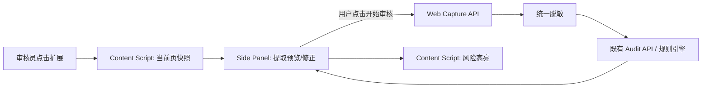

# 网页职位采集总体架构

## 范围与原则

本轮仅支持用户主动触发的 `ASSIST_MODE`：扩展读取当前标签页、在本地展示提取预览，用户确认后才可创建采集记录并发起既有审核。不得自动通过、驳回、点击下一条或循环处理岗位；不调用真实 LLM。

扩展是独立 `apps/browser-extension` 应用；它只依赖稳定的 `@job-compliance/shared` 契约，不复用后台的认证状态、页面组件或模型配置。

## 数据与责任边界

`WebJobCapture` 保存字段值、置信度、来源和可选 DOM 定位信息。采集顺序是 JSON-LD、内嵌 JSON、站点 Adapter、通用 DOM、用户修正，LLM 补全为未来能力。`rawContent` 是受控输入快照，不进入扩展日志；服务端写入前必须调用 `sanitizeAuditLog`，并按照数据保留策略存储。

后端正式接口拟定为 `/api/web-captures`、`/api/web-captures/{id}`、`/api/web-captures/{id}/audit` 与 `/api/web-captures/{id}/corrections`。创建/审核均要求显式 `tenantId`、鉴权、幂等键和来源元数据；`AuditRun` 通过 `captureId` 关联采集记录。第 52 轮仅完成契约与扩展验证，未引入数据库迁移或服务端写接口。

## 主动审核演进

`SEMI_ACTIVE_MODE` 仅可在用户逐次确认后调用站点 Adapter 的只读 `detectNextAction`；`ACTIVE_MODE` 另需独立 ADR、站点白名单、速率限制、去重、页面状态验证、Pause/Stop、Kill Switch、操作审计和异常即停。两种模式均不得默认实施最终处罚。
